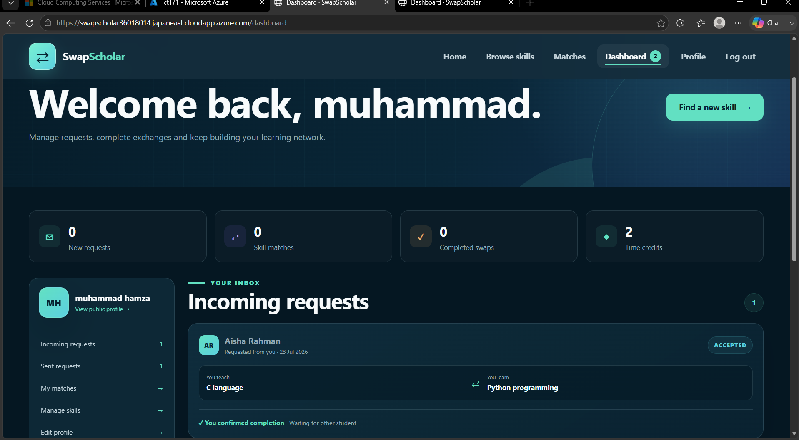
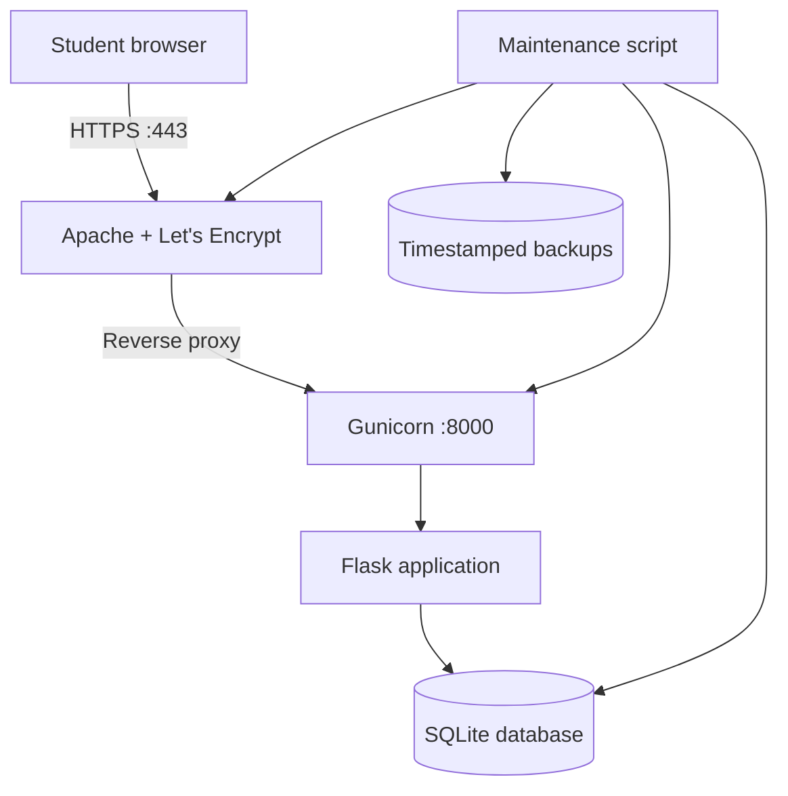
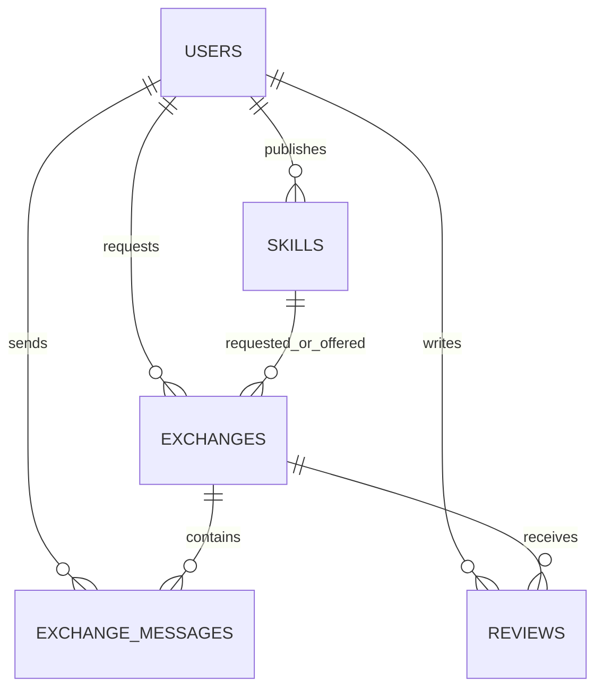
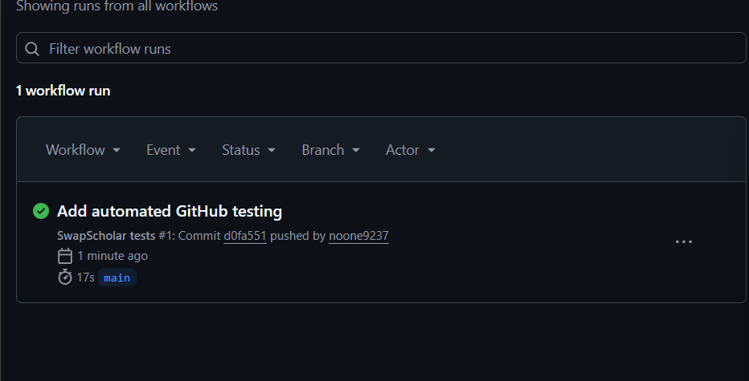
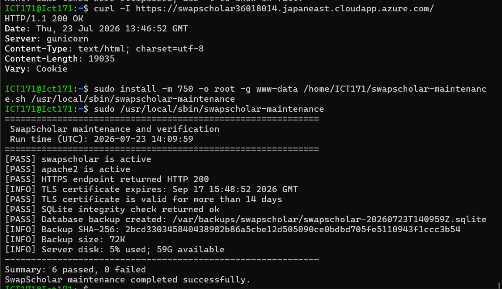
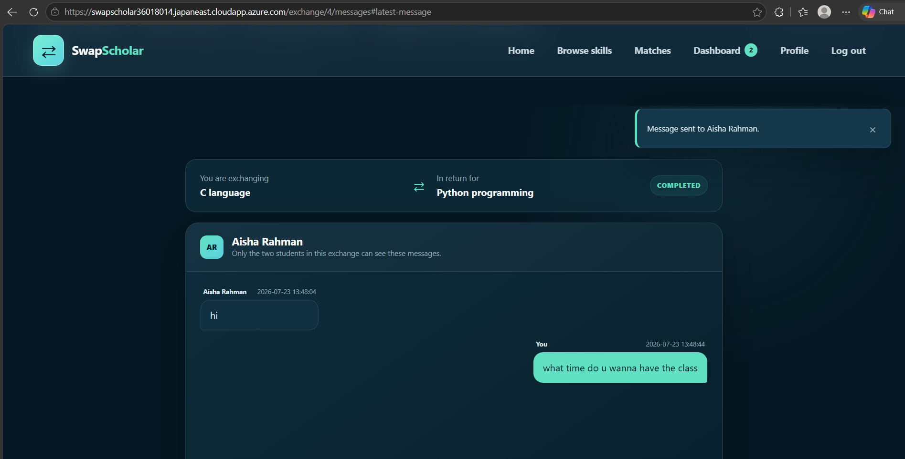

# SwapScholar

**Teach what you know. Learn what you need.**

[](https://www.python.org/)
[](https://flask.palletsprojects.com/)
[](https://azure.microsoft.com/)
[](https://letsencrypt.org/)
[](https://github.com/noone9237/swapscholar-ict171/actions/workflows/tests.yml)

SwapScholar is a cloud-hosted student skill-exchange platform developed for the
ICT171 Cloud Server Project. Students create accounts, publish skills they can
teach and want to learn, discover compatible students, arrange exchanges through
private messages, confirm completion and build trust through reviews.

The application preserves the dark navy and mint visual identity of the original
project proposal while turning the proposal into a complete Flask and SQLite
system deployed on Microsoft Azure.

## Live deployment

| Item | Value |
| --- | --- |
| Secure website | [https://swapscholar36018014.japaneast.cloudapp.azure.com/](https://swapscholar36018014.japaneast.cloudapp.azure.com/) |
| Cloud platform | Microsoft Azure |
| Region | Japan East |
| Operating system | Ubuntu Server 22.04 LTS |
| Public IP | `20.46.113.242` |
| Web stack | Apache → Gunicorn → Flask |
| Database | SQLite |
| Student ID | `36018014` |



## Project purpose

University students often need practical help but may not be able to pay for
private tutoring. At the same time, many students have useful knowledge they can
share. SwapScholar connects those two groups through either:

- **Mutual skill swaps** — both students teach each other.
- **Time-credit exchanges** — one student spends a credit to learn, and the
  teacher receives it after both students confirm completion.

## Implemented features

| Area | Functionality |
| --- | --- |
| Accounts | Registration, login, logout and protected member pages |
| Profiles | University, course, biography, availability, rating and credit balance |
| Skills | Separate offered and wanted skills with categories and descriptions |
| Discovery | Search by skill, student, university or category |
| Matching | Mutual ranking based on compatible offered and wanted skills |
| Requests | Direct swaps and one-credit learning requests |
| Workflow | Accept, reject, cancel and two-sided completion confirmation |
| Messaging | Private conversation available only to the two exchange participants |
| Credits | Reservation on acceptance and transfer after both students confirm |
| Trust | Reviews and 1–5 ratings restricted to completed exchanges |
| Statistics | Live totals and category information generated from SQLite |
| Interface | Responsive desktop, tablet and mobile layouts |

## Exchange workflow

1. A student registers and completes their profile.
2. They add skills they can **offer** and skills they **want**.
3. SwapScholar identifies compatible students or allows manual searching.
4. A direct swap or time-credit request is sent.
5. The recipient accepts or rejects the request.
6. Accepted participants use the private exchange conversation to arrange the
   session.
7. Both students independently confirm completion.
8. Any reserved credit is transferred and both students can submit a review.

## Cloud architecture



Apache owns the public HTTP/HTTPS connection. Gunicorn listens only on
`127.0.0.1:8000`, so the Flask development server is not exposed to the
internet. Production secrets are stored in a protected environment file outside
the repository.

## Database design



SQLite constraints protect valid ratings, credit balances, exchange modes and
exchange status values. Foreign keys and indexes preserve relationships and
support the main search and dashboard queries.

## Security controls

- Passwords are stored as salted Werkzeug password hashes, never plaintext.
- Every state-changing form is protected with a session-based CSRF token.
- Secure production cookies use `HttpOnly`, `SameSite=Lax` and HTTPS-only mode.
- Server-side validation limits names, profiles, skills, requests and messages.
- Ownership checks prevent unrelated users from changing an exchange.
- Private messages are visible only to the requester and recipient.
- Reviews are limited to participants in completed exchanges.
- Gunicorn binds to localhost behind the Apache reverse proxy.
- The production secret and SQLite database are excluded from Git.
- HTTPS is provided using a Let's Encrypt TLS certificate.

## Automated verification

The test suite contains eight functional and security tests:

1. Public pages and seed data render correctly.
2. Registration hashes passwords and assigns starting credits.
3. CSRF protection rejects invalid POST requests.
4. Skill creation produces compatible mutual matches.
5. A direct swap can complete the full request and review workflow.
6. A time credit is reserved and transferred only after both confirmations.
7. An unrelated account cannot modify another exchange.
8. Pending and unrelated users cannot open the private conversation.

Run the tests:

```bash
python -m unittest discover -s tests -v
```

The project was also reviewed with Python compilation, Ruff, Bandit and
JavaScript syntax checks.

### Continuous integration

The repository contains a GitHub Actions workflow at
`.github/workflows/tests.yml`. Every push and pull request installs the declared
dependencies and runs all eight tests on a fresh Ubuntu runner. The first public
workflow run completed successfully.



## Maintenance and backup script

The documented Bash script at
[`deploy/swapscholar-maintenance.sh`](deploy/swapscholar-maintenance.sh)
performs project-specific server maintenance:

- Confirms the SwapScholar and Apache services are active.
- Requests the public HTTPS endpoint and requires HTTP status `200`.
- Reads the Let's Encrypt certificate and checks that it remains valid for at
  least 14 days.
- Runs SQLite `PRAGMA integrity_check`.
- Creates a transactionally consistent timestamped database backup.
- Prints a SHA-256 checksum, backup size and server disk usage.
- Returns a non-zero exit code if any required check fails.

Install and run it on the VM:

```bash
sudo install -m 750 -o root -g www-data \
  /var/www/swapscholar/deploy/swapscholar-maintenance.sh \
  /usr/local/sbin/swapscholar-maintenance

sudo /usr/local/sbin/swapscholar-maintenance
```

The verified production run completed with **6 passed and 0 failed**.



## Private participant messaging

Once an exchange is accepted, the two students receive a private conversation
attached to that exchange. Messages are stored in SQLite, protected by CSRF,
limited to 1,000 characters and inaccessible to unrelated accounts.



## Local development

```bash
python3 -m venv venv
source venv/bin/activate
pip install -r requirements.txt
export SWAPSCHOLAR_SECRET_KEY="local-development-secret"
flask --app app init-db
flask --app app seed-demo
flask --app app run --debug --port 8000
```

Open `http://127.0.0.1:8000`.

On Windows PowerShell, activate the environment with:

```powershell
.\venv\Scripts\Activate.ps1
```

## Demonstration accounts

Run `flask --app app seed-demo` once, then use:

| Name | Email | Password |
| --- | --- | --- |
| Aisha Rahman | `aisha@demo.swapscholar` | `Demo123!` |
| Daniel Kim | `daniel@demo.swapscholar` | `Demo123!` |
| Mia Chen | `mia@demo.swapscholar` | `Demo123!` |
| Omar Hassan | `omar@demo.swapscholar` | `Demo123!` |

These are sample accounts only. The production application also supports new
account registration.

## Production deployment

Detailed commands, permissions, service configuration, Apache reverse-proxy
instructions, validation checks and rollback steps are documented in
[`DEPLOYMENT_GUIDE.md`](DEPLOYMENT_GUIDE.md).

The deployment uses:

- `deploy/swapscholar.service` for the systemd/Gunicorn service.
- `deploy/apache-reverse-proxy.conf` for Apache proxy directives.
- `deploy/swapscholar.env.example` as a safe production-settings template.
- `/etc/swapscholar.env` for the real protected secret values.
- `/var/www/swapscholar/instance/` for the writable production database.

## DNS and HTTPS

The Azure DNS hostname points to the VM public IP:

```text
swapscholar36018014.japaneast.cloudapp.azure.com → 20.46.113.242
```

Apache serves the hostname over HTTPS using a Let's Encrypt certificate.
HTTP/HTTPS use ports `80` and `443`, while SSH administration uses port `22`.
Certificate validity and the public HTTPS response are independently checked by
the maintenance script.

The complete screenshots, commands and interpretation are collected in
[`docs/DNS_SSL_EVIDENCE.md`](docs/DNS_SSL_EVIDENCE.md).

## Project structure

```text
swapscholar-ict171/
├── app.py                         # Flask routes, security and business rules
├── schema.sql                     # SQLite schema, constraints and indexes
├── wsgi.py                        # Gunicorn application entry point
├── requirements.txt               # Python dependencies
├── templates/                     # Reusable Jinja interface pages
├── static/
│   ├── css/style.css              # Responsive proposal-matched theme
│   └── js/app.js                  # Client-side interface behaviour
├── tests/test_app.py              # Automated functional/security tests
├── deploy/
│   ├── swapscholar.service        # systemd/Gunicorn configuration
│   ├── apache-reverse-proxy.conf  # Apache proxy configuration
│   ├── swapscholar.env.example    # Safe environment template
│   └── swapscholar-maintenance.sh # Verification and backup automation
├── docs/screenshots/              # Visible implementation evidence
├── docs/DNS_SSL_EVIDENCE.md       # DNS, HTTPS and certificate proof
├── DEPLOYMENT_GUIDE.md
└── VERIFICATION_REPORT.md
```

## Verification evidence

The following production behaviours have been manually demonstrated:

- Registration and secure login.
- Profile and offered/wanted skill updates.
- Request creation and acceptance by separate accounts.
- Private messages from both exchange participants.
- Independent completion confirmation.
- Review submission after completion.
- HTTPS availability through the Azure DNS hostname.
- Successful server verification and timestamped database backup.

See [`VERIFICATION_REPORT.md`](VERIFICATION_REPORT.md) for the detailed review.

## Academic information

| Item | Details |
| --- | --- |
| Unit | ICT171 Cloud Server Project |
| Project | SwapScholar — Student Skill Exchange Platform |
| Student | Muhammad Hamza |
| Student ID | `36018014` |
| Deployment date | 23 July 2026 |

## Repository safety

The `.gitignore` file excludes virtual environments, cached Python files,
production databases and environment secrets. Never commit:

- `/etc/swapscholar.env`
- `instance/*.sqlite`
- SSH private keys such as `*.pem`
- real passwords, tokens or certificate private keys
