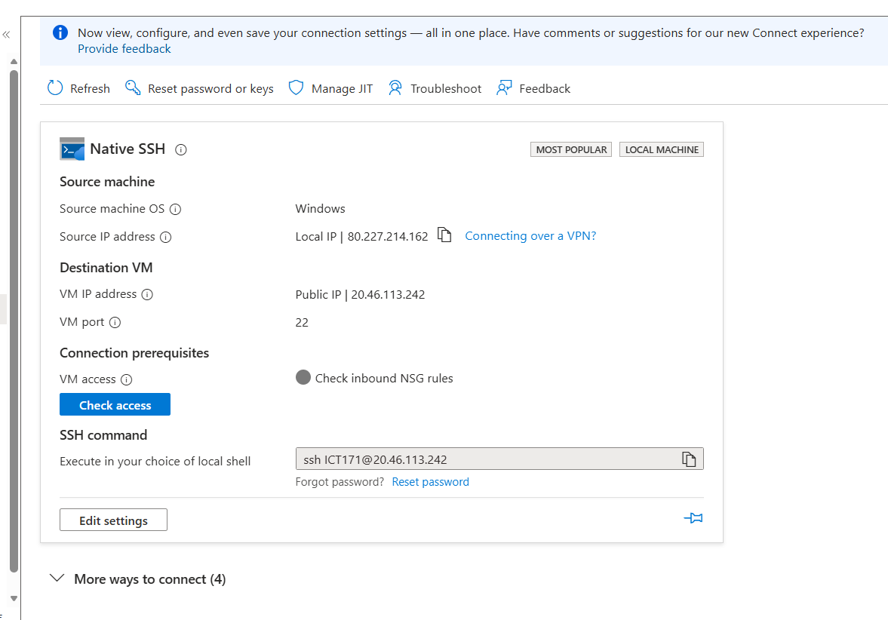
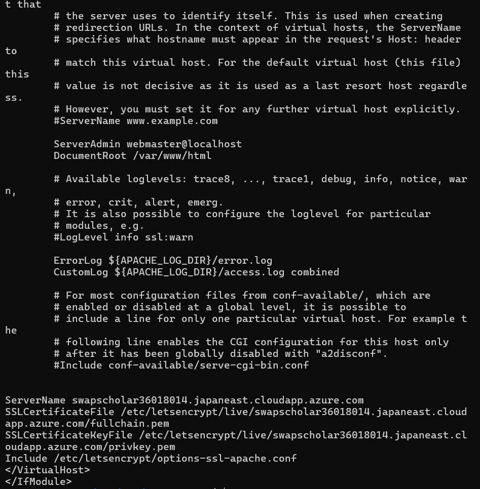
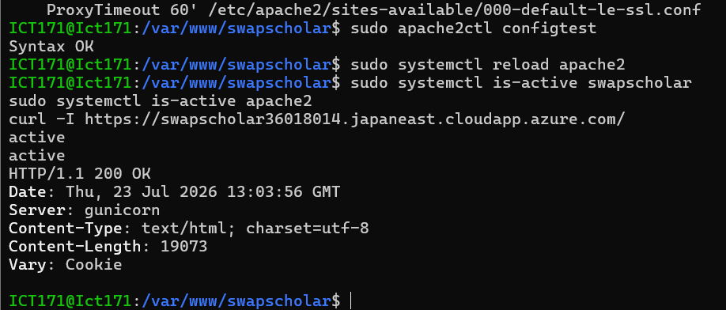

# SwapScholar DNS and SSL/TLS evidence

This document records the DNS and HTTPS configuration for the live ICT171
SwapScholar deployment.

## Deployment identifiers

| Item | Value |
| --- | --- |
| Azure public IP | `20.46.113.242` |
| DNS hostname | `swapscholar36018014.japaneast.cloudapp.azure.com` |
| Secure URL | `https://swapscholar36018014.japaneast.cloudapp.azure.com/` |
| HTTPS port | `443/TCP` |
| Certificate authority | Let's Encrypt |
| Public web server | Apache |
| Internal application server | Gunicorn on `127.0.0.1:8000` |

## 1. Azure public endpoint and DNS evidence

The Azure Native SSH connection view confirms that the destination VM uses
public IP `20.46.113.242` and exposes SSH administration on port `22`.



The deployed browser address, Apache virtual host and certificate configuration
all use the assigned hostname
`swapscholar36018014.japaneast.cloudapp.azure.com`. The hostname allows the
server to be accessed by a stable name rather than requiring users to remember
the IP address. It also provides the identity required for the TLS certificate.

## 2. Apache TLS certificate configuration

Apache contains a `*:443` virtual host for:

```text
swapscholar36018014.japaneast.cloudapp.azure.com
```

The enabled HTTPS virtual host references the Let's Encrypt files:

```text
/etc/letsencrypt/live/swapscholar36018014.japaneast.cloudapp.azure.com/fullchain.pem
/etc/letsencrypt/live/swapscholar36018014.japaneast.cloudapp.azure.com/privkey.pem
```



The private key remains on the VM and is never stored in this repository.

## 3. HTTPS runtime verification

Apache configuration was checked before reloading:

```bash
sudo apache2ctl configtest
sudo systemctl reload apache2
sudo systemctl is-active swapscholar
sudo systemctl is-active apache2
curl -I https://swapscholar36018014.japaneast.cloudapp.azure.com/
```

The evidence shows:

- Apache configuration: `Syntax OK`
- SwapScholar service: `active`
- Apache service: `active`
- Public HTTPS response: `HTTP/1.1 200 OK`



## 4. Browser verification

The live dashboard loads using an `https://` address and the browser displays a
secure-connection lock indicator.


## 5. Certificate lifetime and independent maintenance check

The project maintenance script independently reads the installed certificate
with OpenSSL, verifies that it remains valid for more than 14 days and requests
the public HTTPS endpoint. The recorded production run reported:

```text
[PASS] HTTPS endpoint returned HTTP 200
[INFO] TLS certificate expires: Sep 17 15:48:52 2026 GMT
[PASS] TLS certificate is valid for more than 14 days
```


## Result

The evidence demonstrates that:

1. The DNS hostname resolves the public Azure deployment.
2. Apache is configured with the correct hostname and certificate paths.
3. The public application responds successfully over HTTPS.
4. The certificate lifetime is checked by the reusable maintenance script.
5. No certificate private key or production secret is published in GitHub.
